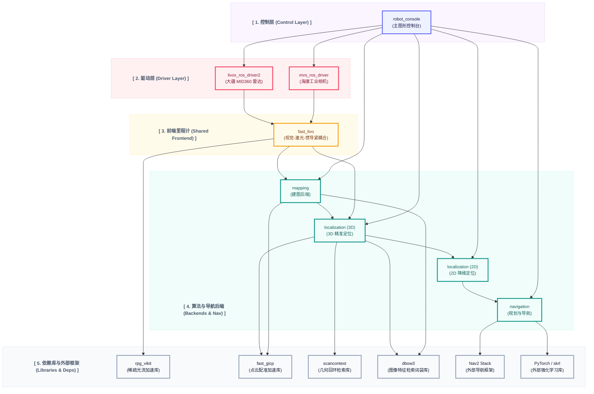
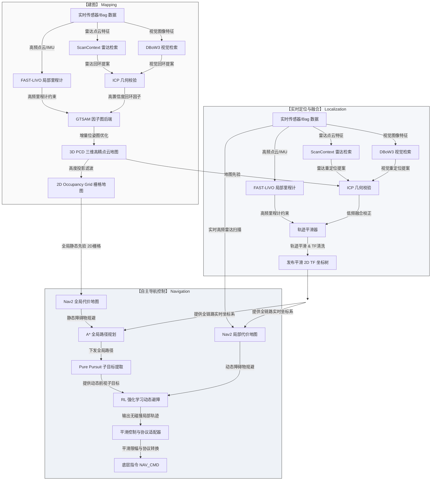
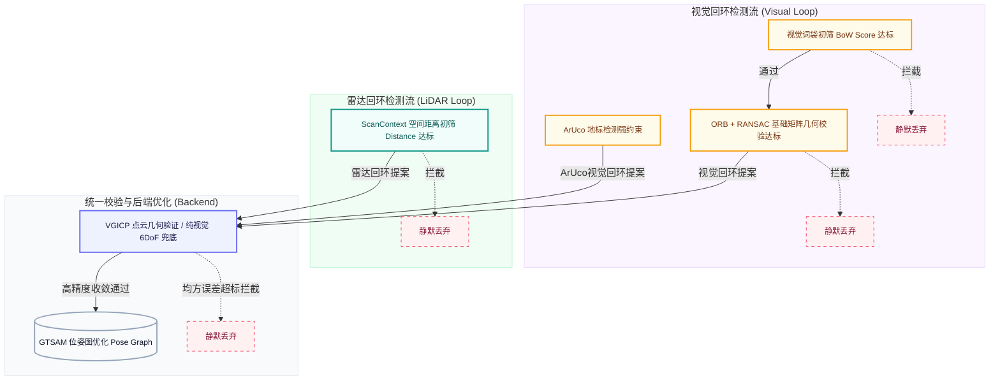
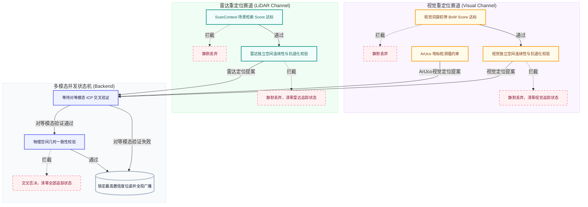
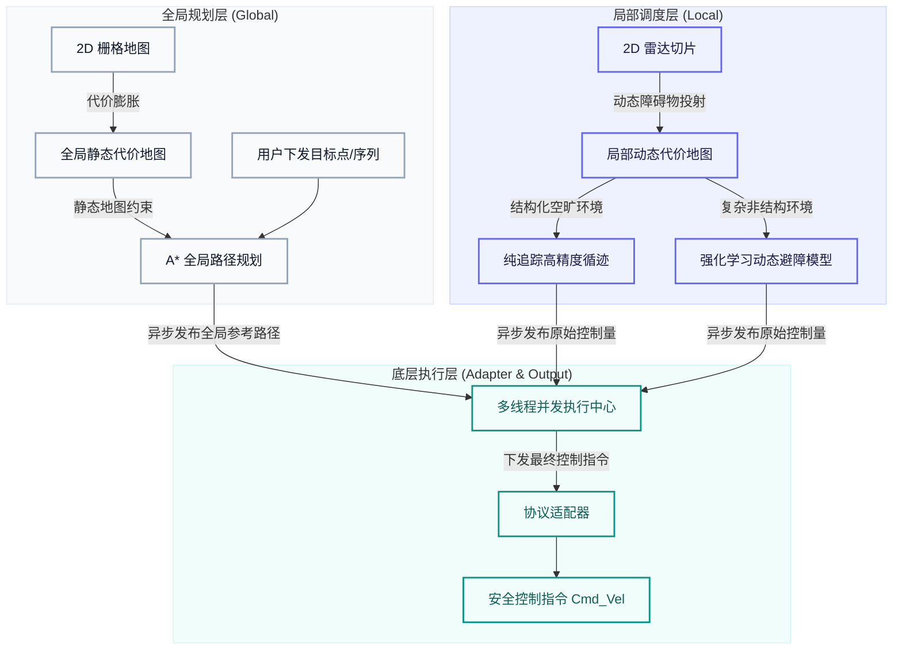
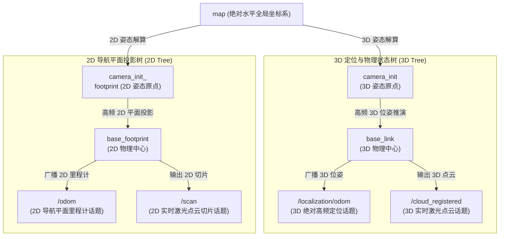

# FAST-LIVO-DOG

[](https://docs.ros.org/)
[](https://en.cppreference.com/w/cpp/17)
[](https://www.python.org/)
[](https://opensource.org/licenses/BSD-3-Clause)

> 当前仓库中的 FAST-LIVO-DOG 原始说明已整体迁入本目录。本文后续章节仍保留原项目
> 的启动、建图、定位和导航说明；当前 dog_patrol 的任务状态机与感知融合接入方式，
> 以同目录 `navigation/dog_patrol_navigation/docs/current_workspace_integration.md`
> 为准。原 README 中的 `src/robot_console/robot_console/app.py` 是原项目路径，
> 当前总入口已经迁移到 dog_patrol 的 `src/orchestration/robot_console/robot_console/app.py`。

## 1. 项目简介 (Project Overview)

FAST-LIVO-DOG 是一个面向高动态四足机器人（机器狗）平台的鲁棒性视觉-激光-惯导融合（LIVO）全栈系统。本系统以解决足式平台高频振动与高动态漂移为核心目标，为高移动性智能终端提供了一套高精度的建图、高可信的定位与安全可靠的导航全流程解决方案。

系统主要包含以下三大核心模块及配套工具功能：

- **建图模块 (Mapping)**：
  集成快速激光-惯导-视觉里程计（FAST-LIVO）与多传感器因子图优化后端（GTSAM），支持大场景高精度 3D PCD 点云地图和 2D 栅格地图构建。引入了 **雷达闭环（Scan Context）**、**普通视觉特征闭环（DBoW3）** 与 **强先验基准闭环（ArUco Marker）** 的三重混合检测机制。特别是 ArUco 回环能提供绝对无歧义的候选对，配合后端雷达点云的硬核 ICP 验证，能在极端退化场景与大长廊环境中，打造伪 Ground-Truth 级别的无漂移建图效果。

- **定位模块 (Localization)**：
  提供极端环境下的非对称仲裁重定位与多源坐标融合引擎。支持 3D ICP 精密重定位与 2D 降维定位，通过高频局域里程计与低频全局重定位信息的高低频互补，实现全局无缝重定位和稳定的 TF 坐标树发布。在全局重定位层面，融合了 **视觉词袋（BoW）检索**、**雷达 Scan Context 检索** 与 **ArUco 地标绝对重定位** 三条并发赛道，在任意尺度场景下均可实现快速、鲁棒的全局位姿恢复。

- **导航模块 (Navigation)**：
  构建了高内聚、低耦合的流水线式导航架构：上层依托 Nav2 提供全局路径规划；中层结合纯追踪（Pure Pursuit）与强化学习（RL）算法，直接利用多传感器数据实现高频动态避障与局部轨迹生成；底层引入平滑追踪算法与专用协议适配模块，在物理碰撞体积约束下输出具备多重安全保护的机器狗底层控制指令，确保在复杂及高动态障碍物环境下的安全避障与精准目标追踪。

- **数据采集与配套控制 (Data Collection & Control UI)**：
  项目配置了高度集成的图形化 PyQt5 交互式控制台，支持雷达/相机硬件传感器驱动的一键启停管理、延迟安全数据录包（ROS 2 Bag 的一键录制、回放与管理）、以及自动化流水线控制，大幅降低调试门槛。

## 2. 快速上手 (Quick Start)

项目配置了高度集成的图形化交互控制台，您可以直接运行控制台并在 GUI 界面中完成编译与核心算法的启动控制：

```bash
# 激活 ROS 2 环境变量并运行控制台入口脚本
source /opt/ros/$ROS_DISTRO/setup.bash
python3 src/robot_console/robot_console/app.py
```

在启动的控制台界面中，您只需执行以下简单步骤即可快速运行系统：

1. **一键编译**：点击 **🔨 一键编译** 自动配置并完成工作空间构建。
2. **硬件/数据准备**：若在真机上运行，点击 **🔌 开启传感器驱动**；若进行离线测试，点击 **▶️ 选择并播放数据包** 导入录制的 Bag 文件。
3. **启动算法**：根据您的具体需求，点击对应的功能按钮：
   - **建图模式**：点击 **🚀 单次建图** 开始扫描并构建环境地图。（注：**🚀 累积建图** 为预留扩展功能）
   - **定位模式**：点击 **🎯 3D定位** 或 **🎯 2D定位** 加载已有的地图，进行高精度的实时重定位。
   - **导航模式**：依次点击 **🎯 2D定位** 与 **🗺️ 2D导航**，启动完整的自动导航与避障框架。（注：**🗺️ 3D导航** 为预留扩展功能）

---

## 3. 环境与强依赖配置 (Prerequisites)

### 3.1 软件与系统依赖

为了编译并运行本系统，您必须在宿主机上预先安装以下**非项目内置**的系统及第三方依赖：

- **操作系统与 ROS 版本**：
  - **Ubuntu 20.04** (ROS 2 Foxy) 或 **Ubuntu 22.04** (ROS 2 Humble)
- **ROS 2 导航与核心功能包** (请根据您的 `ROS_DISTRO` 自行替换版本名称)：
  - `ros-$ROS_DISTRO-nav2-bringup`
  - `ros-$ROS_DISTRO-nav2-map-server`
  - `ros-$ROS_DISTRO-nav2-lifecycle-manager`
  - `ros-$ROS_DISTRO-cv-bridge`
  - `ros-$ROS_DISTRO-image-transport`
  - `ros-$ROS_DISTRO-pcl-conversions`
  - `ros-$ROS_DISTRO-pcl-ros`
  - `ros-$ROS_DISTRO-tf2-geometry-msgs`
- **C++ 第三方核心算力库 (⚠️ 重要)**：
  - **PCL** (1.10+) / **OpenCV** (4.x) / **Eigen3** / **libusb-1.0** (常规依赖，可通过基础包管理器安装)
  - **Sophus (李代数库)**：必须安装以支持 FAST-LIVO 流形运算，建议直接通过 ROS 2 官方源一键安装 (当前环境版本 `1.22.9102`)：
    ```bash
    sudo apt install ros-$ROS_DISTRO-sophus
    ```
  - **GTSAM (因子图优化库，强制要求 4.1.1 版本)**：
    ⚠️ **请勿使用 `apt install ros-humble-gtsam` 安装！** 本项目的 `mapping` 后端强依赖 4.1.1 版本的特定 API。请按照以下命令拉取官方源码进行底层编译安装：
    ```bash
    git clone -b 4.1.1 https://github.com/borglab/gtsam.git
    cd gtsam
    mkdir build && cd build
    cmake .. -DGTSAM_BUILD_WITH_MARCH_NATIVE=OFF -DGTSAM_USE_SYSTEM_EIGEN=ON
    make -j$(nproc)
    sudo make install
    ```
- **Python 依赖包**：
  - 控制台界面：`PyQt5`, `pyyaml`
  - 导航与追踪模块：`numpy`, `transforms3d`, `tf-transformations` (ROS 包名：`ros-$ROS_DISTRO-tf-transformations`)
  - 强化学习与推理加速：`torch` (支持 CUDA), `skrl`, `gymnasium`, `ultralytics` (YOLOv8 算法支持)

### 3.2 推荐硬件配置

本系统在边缘端（如车载工控机或嵌入式板卡）运行时需承担密集的高频三维点云融合、地图拼接及神经网络实时推理，推荐硬件配置如下：

- **处理器 (CPU)**：Intel i7 / AMD Ryzen 7 或 NVIDIA Jetson Orin NX (16GB) 及以上
- **内存 (RAM)**：16 GB 及以上
- **显卡 (GPU)**：NVIDIA RTX 系列独立显卡 或 Jetson Orin 板载 Ampere 架构 GPU
- **CUDA 支持**：CUDA 11.3+ / 12.x 及配套 cuDNN
- **传感器方案**：针对 **Livox MID360** 激光雷达与高帧率工业相机。关于传感器的硬件连接与外参标定设置，可参考港大 mars 实验室的开源仓库 [LIV_handhold_2](https://github.com/hku-mars/LIV_handhold_2/tree/main)。

---

## 4. 操作与配置指南 (User Guide)

### 4.1 参数配置说明

#### 4.1.1 设备与外参配置 (Device Parameters)

项目将雷达、相机、惯导（IMU）等硬件外参及传感器基本信息统一收拢。算法运行时加载的活动参数路径为：
📂 **`config/device_parameters.yaml`**

> [!IMPORTANT]
> `device_parameters.yaml` 在控制台运行时会被 GUI 自动覆盖。请勿直接修改该文件！如需修改标定内参或外参，请编辑或通过控制台 **⚙️ 选择设备参数配置文件** 来载入以下模板目录下的配置：
> 📂 **`config/device_profiles/`**

模板目录下预置了以下兼容双分辨率与运动模式的配置文件：

- **`stationary.yaml`** (默认)：用于机器狗上固定设备的建图、定位与导航场景，默认采用 640x512 降采样分辨率（行尾附 1280x1024 内参）。
- **`mobile.yaml`**：用于手持式设备的建图与定位场景，默认采用 640x512 降采样分辨率（行尾附 1280x1024 内参）。

每个配置文件中的核心参数项包括：

- **外参变换矩阵**：配置 IMU、相机及激光雷达之间的相对外参矩阵，以及激光雷达到机器狗物理中心（`base_link`）的外参变换。
- **相机内参及畸变系数**：配置相机焦距、光心坐标及畸变系数，用于视觉特征点的重投影与图像对齐。
- **数据话题名称**：配置相机图像、雷达点云及 IMU 数据对应的 ROS 2 订阅话题。
- **ArUco 闭环配置**：(位于 `aruco:` 下) 控制高精度二维码回环检测的开关（`aruco_en`）、字典类型（`dictionary`）与物理尺寸（`marker_size`）。

#### 4.1.2 导航与避障配置 (Navigation Parameters)

导航底层控制与避障代价图的参数配置集中存储在以下文件中：
📂 **`config/nav_parameters.yaml`**

- **地图投影与栅格化**：配置将三维点云地图投影为二维导航网格图的高度裁剪范围、噪声过滤半径及 2D 连通域二次去噪机制。
- **Nav2 规划与代价图**：配置全局和局部代价图（Costmap）的膨胀半径（全局 `0.8m` 提升窄道/门洞通过性，局部 `1.0m` 加强动态避障提前量与安全侧向距离）、机器人轮廓几何尺寸以及避障传感器扫描参数。
- **控制器与运动约束**：配置机器狗底盘控制的运动学约束（最大/最小线速度、最大角速度及加速度限幅），以适配足式平台的运动死区。
- **生命周期管理器配置**：配置生命周期节点的连接与服务响应超时机制，避免在离线回放或系统高负载时因地图配置超时或心跳丢失触发节点未就绪与虚警重置。

### 4.2 控制台运行与操作流程

控制台界面以业务模块化布局组织了整个工作流。常用操作流程如下：

- **准备阶段（编译与驱动）**：
  - 使用 **🔨 一键编译** 可对工作空间进行清理与多线程全量编译。
  - 连接实体传感器后，使用 **🔌 开启传感器驱动** 启动相机和雷达。若需要采集数据，点击 **🔴 录制传感器数据** 将弹出录包配置窗口。您可以在此指定保存路径，选择**仅录制雷达和 IMU**（剔除图像以节省空间），以及开启**录制结束后自动压缩**功能（后台无缝转换为 MCAP 格式并清理原文件，极大减少磁盘占用）。

- **可视化监视 (按需 RViz 状态机)**：
  - 系统提供了一个动态的 **🖥️ 开启Rviz** 按钮。它会根据当前底层的运行模式（如：建图、3D定位、2D定位/导航、或闲置）智能推断并加载对应的高级可视化配置环境。查阅完毕后可随时点击 **🚫 关闭Rviz** 一键释放系统的渲染算力。

- **参数与路径设定**：
  - 通过 **📂 设置地图存放/读取目录** 选择地图数据的存取路径（系统会自动配置并补齐目标路径下的视觉词典等基础设施）。
  - 通过 **⚙️ 选择设备参数配置文件** 切换不同底盘的标定参数（如平移、旋转及内参）。

- **核心算法模式运行**：
  - **建图**：点击 **🚀 单次建图** 启动里程计与后端因子图优化节点，完成建图后自动保存 3D PCD 全量点云、真彩色点云及 2D 栅格地图（`map_2d.pgm`）。
  - **3D 定位**：点击 **🎯 3D定位** 载入 3D 点云地图，运行三维点云匹配与高精度融合定位。
  - **2D 定位与 Nav2 导航**：
    - 1. 点击 **🎯 2D定位** 载入 2D 栅格地图，启动降维定位算法，输出全局 TF 坐标。
    - 2. 当 2D 定位运行后，控制台将自动解锁 **🗺️ 2D导航** 按钮。
    - 3. 点击 **🗺️ 2D导航** 启动避障代价图与路径规划/控制器，此时可呼出 RViz 窗口下发导航目标点。

- **离线调试与数据回放**：
  - 若不连接真实硬件，点击 **▶️ 选择并播放数据包** 喂入录制的 Bag 数据。系统会自动注入仿真时间（`use_sim_time:=true`），支持倍速播放与随机断点抽检。

- **系统复位与多维度日志管理**：
  - **标签化日志分页监控**：主控台右侧提供了强大的日志分页追踪功能。除了可以查看所有输出流的 `ALL` 全局面板外，您还可以通过切换标签页单独监控系统 (`SYS`)、编译 (`BUILD`)、传感器 (`CAMERA`/`LIDAR`)、建图 (`MAP`)、定位 (`LOC`) 以及导航 (`NAV`) 等特定模块。所有的底层节点均拥有专属前缀和动态上色，极大降低了排错成本。
  - 点击 **🧹 清空日志** / **📋 复制日志** / **💾 保存日志** 可对当前面板的日志输出进行独立管理。
  - 点击 **⏯ 停止节点** 可安全终止所有后台运行的话题与算法进程，并自动清理防呆残留的 RViz 窗口。
  - 点击 **❌ 退出平台** 可执行最高优先级的安全退出并释放所有硬件与内存锁。

---

## 5. 系统架构与模块分工 (Architecture)

### 5.1 架构拓扑 (System Architecture)

系统实现了从“硬件驱动采集 -> 数据异步落盘 -> 因子图建图 -> 状态机重定位 -> 规划与导航”的全生命周期闭环设计，整体拓扑架构如下：



### 5.2 核心依赖与层级关系

本系统的核心定位与导航链路具备严格的层级演进和数据依赖关系：



1. **定位与导航的层级关系**：
   - **建图 (Mapping)**：是后续所有工作的基础。通过采集多传感器 Bag 并离线运行 `mapping` 模块，构建出 3D PCD 点云地图和 2D 栅格地图。
   - **3D 精准定位 (3D Localization)**：以建图阶段导出的 3D 点云地图为物理先验，利用 Scan-to-Map 点云配准解算实时三维位姿。
   - **2D 降维定位 (2D Localization)**：在 3D 实时定位位姿的基础之上，加载 2D 栅格地图，将三维坐标降维投影并计算发布稳定的 2D 地图 TF 坐标树。
   - **自主导航 (Navigation)**：以 2D 降维定位发布的 TF 树与全局位姿为基础，输入避障代价图，实现路径规划与底盘运动控制。
2. **导航外部依赖库**：
   - 导航模块底层高度依赖外部系统级安装的 ROS 2 Nav2 Stack 导航框架（包括 `nav2_map_server` 等组件）来实现避障代价图构建和全局路径探索。
   - 智能避障与控制策略需导入外部 PyTorch 机器学习框架以及 skrl / gymnasium 等强化学习基础库。系统启动时通过 `ExecuteProcess` 以 `"python3"` 命令调用节点，这将自动依赖终端的 PATH 环境变量。因此在启动前，请务必在终端中 `source` 激活包含所需依赖的虚拟环境。

### 5.3 功能包模块分工

- **`dbow3`** (内置库)：稀疏图像特征检索词袋库，用于建图时的视觉回环验证及定位时的快速视觉全局重定位提案。
- **`fast_gicp`** (内置库)：点云配准匹配加速引擎，供建图后端（回环检测验证）与定位后端（实时扫描匹配）共同使用。
- **`fast_livo`**：共享的前端里程计。基于视觉-激光-惯导紧耦合框架输出高频里程计约束。
- **`livox_ros_driver2`**：大疆 MID360 雷达 ROS 2 驱动程序，采集并发布原始雷达点云与 IMU 数据。
- **`localization`**：独立定位后端。载入建图序列化特征，提供基于非对称状态机的全局重定位与高精度跟踪，支持 3D 定位与 2D 投影定位。
- **`mapping`**：独立建图后端。整合里程计约束与闭环因子，提供位姿图优化，并将地图及特征序列化输出。
- **`mvs_ros_driver`**：海康工业相机 ROS 2 驱动程序，采集并发布高频图像数据。
- **`navigation`**：集成 A\* 全局路径、纯追踪（Pure Pursuit）子目标提取与强化学习（RL）动态避障的高频流水线控制模块，并内置具有多重安全约束的底层协议适配器（Adapter）。
- **`robot_console`**：基于 PyQt5 构建的交互式高级控制台，支持 2D 轨迹实时可视化、多分页日志捕获，以及零开销的传感器硬件心跳频率（相机、雷达、IMU）后台侦听与自动显示。
- **`rpg_vikit`** (内置库)：稀疏光流加速库。在本项目中作为 `fast_livo` 的前端视觉特征与光流跟踪加速核心。
- **`scancontext`** (内置库)：点云全局几何描述子检索及闭环引擎。

---

## 6. 核心算法特性 (Advanced Features)

### 6.1 建图算法特性 (Mapping Features)

- **高频里程计驱动的关键帧抽取与多模态特征编码**：依托底层高精度高频里程计提供的严格空间位移与角度变化约束，自适应抽取空间关键帧。同步提取视觉画面的高维特征描述子与雷达点云的几何特征，实现多源原始数据的严格时空对齐与深层绑定。
- **雷达 ScanContext 几何全局检索与初筛**：利用三维点云在空间中的分布特征构建全局几何描述符。在缺乏纹理、特征极度相似或光照变化剧烈的场景中，依然能依靠场景的三维骨架进行大范围极速检索，并结合粗略空间距离校验剔除明显非法的重叠候选。
- **视觉 DBoW 词袋拓扑检索与绝对同步**：建立层级化的视觉词典以打破传统特征匹配在超大规模地图下的算力瓶颈。针对极端光照引发的空帧与索引脱节问题，引入底层映射字典实现了历史特征描述子与后端关键帧 ID 的绝对同步，确保了回环匹配在极其恶劣环境下的高召回与高精准度。
- **多模态统一终审引擎与增量式图优化**：无论是基于光度拓扑的视觉提案，还是基于空间骨架的雷达提案，均被收拢至后端的体素化 ICP 配准引擎进行物理几何层面的统一终审。通过验证的高置信度闭环将作为约束边，送入增量平差框架中动态优化并维护全局位姿图，从根本上根除长时间大尺度运行的累计漂移。当雷达发生极度几何退化导致 ICP 失败时，系统将触发纯视觉 PGO 兜底机制，利用前端雷达里程计恢复绝对尺度，将视觉解算的 6DoF 相对位姿强制作为低权重鲁棒约束加入因子图，挽救地图崩溃。
- **特征数据序列化与多模态模型持久化**：建图运行期间不仅实时构建高精点云地图，在系统终止时，还会将所有关键帧的高维特征描述子批量下采样，并序列化导出为稀疏词袋向量文件。保障建图端与重定位端之间庞大多模态特征数据的高效无损传递。

#### 附：多模态回环检测工作流 (Multi-modal Loop Closure Pipeline)

本系统采用严格的“多关卡独立初筛 + 统一终审”架构，保障地图闭环的高召回与零误判：



### 6.2 定位算法特性 (Localization Features)

- **多模态异源提案与独立盲推校验**：结合视觉光度检索的瞬时性与雷达几何检索的空间刚性，双通道并发生成重定位提案，互不阻塞。任何提案均需强制通过连续多帧的物理空间位移盲推（或静态超时兜底验证），作为单模态赛道的严格抗假阳性初筛。
- **交叉否决与单模兜底联合裁决**：引入并发验证与终审机制，当双模态均给出初步定位时，通过严密的空间几何一致性测算达成共识，若存在显著空间冲突则触发交叉否决清零；当单一模态闲置或失效时，支持高置信度模态独立兜底，完美适应异源环境的特征非对称性。
- **四级柔性状态机流转**：突破传统的“定位/丢失”二元论，建立涵盖“成功、过渡、失败、退化”的四级追踪状态矩阵。在不同置信度与场景下动态调整后端的纠偏策略，确保整体定位行为的连贯性与鲁棒性。
- **动态膨胀容忍与高频二阶阻尼平滑**：根据机器人的运动状态自适应膨胀追踪阶段的误差容忍阈值。底层采用数据驱动的高频级联阻尼滤波器，强制将所有的定位误差转化为 S 型曲线的平滑渐进归位。在实现“所见即所得”且高度贴合扫描点云纯净可视化的同时，彻底消除轨迹毛刺并严格避免导航底盘触发急刹或过冲。
- **重力绝对约束与几何退化护盾**：针对受重力绝对约束的倾角与平移/偏航角进行多维解耦。当检测到楼梯大倾角或遭遇长廊、白墙等几何特征奇异环境时，触发退化护盾拒绝伪收敛，系统转由前端里程计平滑盲推，根治死角场景下的频繁误注销。
- **多级自适应检索与死区稳态滤波**：在彻底丢失追踪时，系统通过自适应扩大搜索半径进行局部子图检索，并在越过安全上限后无缝切换全局搜索；结合滞回滤波机制过滤静止微小漂移，兼顾极速唤醒响应与微观驻车稳定性。

#### 附：多模态全局重定位工作流 (Multi-modal Global Relocalization Pipeline)

本系统实现了“双轨解耦、并发赛马”的多模态高鲁棒重定位架构，结合视觉的瞬时检索优势与雷达的空间刚性优势，并支持动态兜底与降级模式：



#### 附：定位状态机裁决矩阵 (Localization State Matrix)

系统在平地运行过程中的核心重定位与跟踪控制流，可由以下状态矩阵进行精确定义：

| 状态分类                 | **全局重定位（未定位状态）**                                                                                                                                                                                                                                                                                                               | **局部跟踪（已定位状态）**                                                                                                                                                                                                                                                                                                                                 |
| :----------------------- | :----------------------------------------------------------------------------------------------------------------------------------------------------------------------------------------------------------------------------------------------------------------------------------------------------------------------------------------- | :--------------------------------------------------------------------------------------------------------------------------------------------------------------------------------------------------------------------------------------------------------------------------------------------------------------------------------------------------------- |
| 🟢 **成功 (Success)**    | **【触发条件】**：满足以下全部条件：<br>1. 收到有效的初始定位提案<br>2. 提案通过连续 3 帧的空间连续性盲推校验<br>3. 未检测到环境发生几何退化<br>4. 交叉裁决通过（单模态兜底或双模态空间偏差一致）<br><br>**【系统行为】**：<br>1. 锁定最高置信度位姿并全网广播<br>2. 系统切换至已定位状态并重置漂移累加值<br>3. 激活高频位姿发布与轨迹渲染 | **【触发条件】**：满足以下全部条件：<br>1. 配准误差不超过严格误差阈值<br>2. 满足重力锁<br>3. 平移与旋转偏差不超过动态收敛阈值<br><br>**【系统行为】**：<br>1. 维持定位状态，引入全局校准位姿修正<br>2. **重置**动态阈值膨胀里程计、**重置**生存预算里程计、**重置**丢失帧计时器                                                                            |
| 🟡 **过渡 (Coasting)**   | /                                                                                                                                                                                                                                                                                                                                          | **【触发条件】**：满足以下全部条件：<br>1. 配准误差超过严格误差阈值，但不超过宽松误差阈值<br>2. 满足重力锁<br>3. 平移与旋转偏差不超过动态收敛阈值<br><br>**【系统行为】**：<br>1. 维持定位状态，拒绝位姿修正以防跳变<br>2. **累加**动态阈值膨胀里程计、**重置**生存预算里程计、**冻结**丢失帧计时器                                                        |
| 🔴 **失败 (Failure)**    | **【触发条件】**：满足以下任一条件：<br>1. 未收到有效的初始定位提案<br>2. 提案未通过连续 3 帧的空间连续性盲推校验<br>3. 检测到环境发生几何退化<br>4. 交叉裁决未通过（双模态空间存在显著几何冲突）<br><br>**【系统行为】**：<br>1. 强制清零追踪验证进度<br>2. 维持未定位状态与纯里程计平滑盲推                                              | **【触发条件】**：满足以下任一条件：<br>1. 配准误差超过宽松误差阈值（但不发生数值爆炸）<br>2. 不满足重力锁<br>3. 平移或旋转偏差超过动态收敛阈值<br><br>**【系统行为】**：<br>1. 维持定位状态，拒绝位姿修正以防跳变<br>2. **累加**动态阈值膨胀里程计、**累加**生存预算里程计、**累加**丢失帧计时器<br>3. 若计时器与生存里程计同时达到上限，重置为未定位状态 |
| ⚫ **退化 (Degeneracy)** | /                                                                                                                                                                                                                                                                                                                                          | **【触发条件】**：<br>配准误差发生数值爆炸<br><br>**【系统行为】**：<br>立刻重置为未定位状态                                                                                                                                                                                                                                                               |

### 6.3 导航控制流水线 (Navigation Pipeline)

本系统的导航模块采用分层递进架构，将宏观路径规划与微观动态避障解耦。底层引入协议适配器以满足足式机器人严苛的物理运动学约束。

- **多态局部规划调度引擎**：
  - **经典纯追踪 (Pure Pursuit)**：在已知或结构化、无动态遮挡的路径下，系统默认激活高精度纯追踪算法，保证底盘严格贴合全局参考路径，消除横向循迹误差。
  - **强化学习避障 (RL2Path)**：一旦检测到密集动态障碍物或偏离全局路径，系统无缝热切至预训练的强化学习避障模型。该模型直接摄取实时高频雷达切片状态，在复杂拥堵环境中自主“钻缝”或绕行。
- **Nav2 深度协同与代价图自适应**：
  - 并非简单套用 Nav2，而是深度接管了代价地图（Costmap）的更新机制。利用重定位节点投射出的自适应 2D 雷达切片，动态更新局部与全局代价图。
  - 引入了基于底盘真实物理尺寸的非圆对称膨胀机制，防止狗体在狭窄走廊中发生侧向刮蹭，同时保障局部路径的动态重规划。
- **物理底层协议适配器 (Safety Adapter)**：
  - **算力雪崩防线 (速度限幅)**：在控制指令下发的最底层实施严苛的角速度与线速度饱和限幅。有效防止极速动态避障时，因机器人剧烈甩头导致视觉里程计（VIO）光流大面积跟丢。
  - **死区规避**：针对四足机器狗特定的起步/转向物理死区，实施非线性映射，防止低速指令被底盘关节底层死区吞噬导致停滞。

#### 附：导航控制层级架构图 (Navigation Architecture)



### 6.4 极端嵌入式平台算力与安全优化 (Platform Optimization & Safety)

- **前端计算主动降维与解耦**：前端支持图像等比例缩放配置，使特征提取与光流追踪计算负荷显著下降。用于点云配准的高精度点云仅保留在内存中，而可视化的点云在发布前通过体素滤波降采样，节约图形界面渲染开销。
- **极低延迟的 QoS 通信链路**：为保证高速动态避障的零滞后响应，从传感器输入到底盘指令输出的 ROS 2 通信队列深度已被极致压缩。系统严格杜绝了消息堆积，确保强化学习策略或局部规划器始终使用最新的一帧状态数据。
- **重定位重负载防雪崩控制**：全局检索通道引入原子状态锁与线程数限制，高负载时主动丢弃阻碍帧以避免计算堆积。
- **安全锁与优雅释放防线**：控制台提供一键录包全局互锁状态机。停止节点时发送标准终止信号并预留适当时间缓冲，避免强制终止进程导致数据损坏。
- **RViz 渲染按需解绑与降频**：将耗费大量算力的 RViz 3D 渲染与底层感知逻辑彻底解绑。通过按需启停高消耗的图形节点，并在脑眼分离的设计下大幅降低 UI 渲染频率，在维持底层算法极速避障的同时，有效规避远程带宽撑爆引发的网络阻塞及定位滞后。
- **生命周期心跳超时解耦**：禁用导航及地图生命周期管理器的心跳监测，彻底规避由于仿真时钟暂停、跳跃或高负载调度引发的系统节点误杀与雪崩式复位。
- **计算加速库多线程封印**：在系统全局强制约束神经网络等底层数学运算池的多线程蔓延，避免密集矩阵计算引发的 CPU 假死（spin-wait）。此举严格保障了核心定位模块（VIO 光流与特征提取）的实时算力防线，防止嵌入式主板过热降频导致系统雪崩。
- **防 VIO 崩溃底层限幅**：在控制指令下发的最底层（Adapter）引入了物理角速度与线速度的安全饱和限幅。有效防止极速动态避障时，因剧烈甩头导致视觉里程计（VIO）光流大面积跟丢，规避 SLAM 前端单核算力挤兑。
- **动态 VIO 降维与极简算力护盾**：创新性提出“非对称跟踪算力解耦”架构。在系统处于全局定位搜索时，全开视觉光度与雷达几何特征（LIVO 模式）以确保最高召回率与鲁棒性；一旦系统锁定绝对坐标并切入局部跟踪，自动触发热切换，动态关闭内部的光流特征引擎（LIO 模式）。该机制在不引起轨迹跳变的前提下，可凭空释放极高比例的 CPU 算力供给下游 3D 导航与深度学习算法，同时保障前端独立剥离渲染无特征噪点的纯净实时监视画面。
- **定位与导航管道极致精简**：通过内存持久化缓存空间索引树，并结合降采样与免位姿重构的向量化裁剪算法，从根本上消除了重定位迷失阶段与高频局部跟踪时的密集算力开销，确保在 Jetson Orin 等边缘计算设备上 CPU 负荷极低，为下游的 AI 检测模型与并发作业预留充足算力。

---

## 7. 数据接口与 TF 树 (API & Data Flow)

### 7.1 TF 坐标树与 2D/3D 平行对偶架构

由于系统在建图与定位初始化阶段全量开启了重力垂直对齐（`gravity_align_en: true`），全局坐标系 `map` 与 `camera_init` 本身已原生具备 100% 绝对水平特性，所有路径、点云及可视化直接在原生 `map` 坐标系下进行无畸变渲染与计算。

为了兼顾 3D SLAM 的高精度空间状态估计与 2D Nav2 导航的平面规划避障需求，系统设计了以 `map` 为共同祖先的 **3D/2D 平行对偶坐标树**：

1. **3D 定位与物理状态树 (3D Physical Kinematic Tree)**：
   - **作用**：完全基于真实的三维点云空间，用于 FAST-LIVO 状态估计、点云 ICP 重定位、高程计算与机器狗物理姿态感知。
   - **拓扑**：`map` $\rightarrow$ `camera_init` $\rightarrow$ `base_link`。
2. **2D 导航平面投影树 (2D Planar Navigation Tree)**：
   - **作用**：专供 Nav2 全局规划器（A\*）与局部控制器（DWB/MPPI）使用，由 `odom_bridge` 节点将 3D 位姿实时垂直投影拍平（硬抹 $Z=0.0$, $\text{Roll}=0.0$, $\text{Pitch}=0.0$），消除高程与姿态倾斜干扰。
   - **拓扑**：`map` $\rightarrow$ **`camera_init_footprint`** $\rightarrow$ `base_footprint`。由 `odom_bridge` 节点高频解算广播。
3. **自适应地形随动切片与对偶桥接 (Dynamic Obstacle & Dual Bridging)**：
   - **核心机制**：为了防止多父节点回路冲突（TF loop conflict），3D 物理树与 2D 导航树在 TF 架构中保持解耦。
   - **工程设计**：所有供 2D 导航代价地图消费的动态点云切片（如 `pointcloud_to_laserscan` 生成的 `/scan`），其 `target_frame` 挂载在物理躯干 `base_link` 上。切片刀随躯干动态起伏（自适应坡度随动），完美规避因机器狗上下颠簸造成的 Z 轴绝对漂移，杜绝将真实坡道误判为“假墙”；生成的 2D 扫描数据自动被投影融合进 Nav2 以 `camera_init_footprint -> base_footprint` 为基准的代价地图中。



### 7.2 主要输入/传感器话题

- `/left_camera/image` (`sensor_msgs/msg/Image`): 相机图像信息输入（默认降采样为 640x512，供 FAST-LIVO 里程计与建图定位使用）。
- `/left_camera/image_raw` (`sensor_msgs/msg/Image`): 相机原始高清图像（1280x1024 原生分辨率，专供人脸识别/目标检测等下游感知模块使用）。
- `/livox/lidar` (`sensor_msgs/msg/PointCloud2`): LiDAR 三维原始激光点云。
- `/livox/imu` (`sensor_msgs/msg/Imu`): IMU 高频惯导数据（代码及配置默认话题）。
- `/initialpose` (`geometry_msgs/msg/PoseWithCovarianceStamped`): RViz 界面下发的 2D 手动重定位初始位姿。
- `/clicked_point` (`geometry_msgs/msg/PointStamped`): 唯一统一的导航路径下发入口，支持单点到达与多点连续巡航。

### 7.3 主要输出话题

#### 7.3.1 建图模式 (Mapping Mode)

- `/cloud_registered` (`sensor_msgs/msg/PointCloud2`): 经前端畸变纠正与配准后的实时高频单帧激光点云。
- `/aft_mapped_to_init` (`nav_msgs/msg/Odometry`): 共享前端输出的实时高频 LIO/LO 局部里程计位姿。
- `/path` (`nav_msgs/msg/Path`): 共享前端累计的关键帧历史运动轨迹。
- `/aft_pgo_odom` (`nav_msgs/msg/Odometry`): 后端位姿图优化（GTSAM）与闭环修正后的全局里程计位姿。
- `/aft_pgo_path` (`nav_msgs/msg/Path`): 经闭环约束修正后的全局一致性优化轨迹。

#### 7.3.2 定位模式 (Localization Mode)

- `/map` (`sensor_msgs/msg/PointCloud2`): 由地图加载器发布的全局稠密三维先验点云地图。
- `/localization` (`nav_msgs/msg/Odometry`): 融合滤波输出的高频、平滑、无累积漂移的 6-DoF 绝对空间定位位姿（参考系 `map`）。
- `/global_path` (`nav_msgs/msg/Path`): 在全局 `map` 坐标系下累计的历史 3D 定位轨迹。
- `/map_to_odom` (`nav_msgs/msg/Odometry`): 后端重定位计算输出的低频全局校准增量（用于修正前端漂移）。
- `/cur_scan_in_map` (`sensor_msgs/msg/PointCloud2`): 当前雷达帧配准投影到全局地图坐标系下的实时点云。
- `/localization_status` (`std_msgs/msg/Bool`): 重定位状态锁定指示（`true` 代表锁死，`false` 代表退化/丢失中）。
- `/odom` (`nav_msgs/msg/Odometry`): 专供 2D 路径追踪与避障规划使用的 2D 降维平面导航里程计（参考系 `camera_init_footprint`）。
- `/global_localization/submap_highlight` (`sensor_msgs/msg/PointCloud2`): 由重定位定时器发布的自适应动态重定位局部搜索域约束点云（X 轴彩虹渐变着色）。

#### 7.3.3 导航模式 (Navigation Mode)

- `/global_path` (`nav_msgs/msg/Path`): 由 Nav2 全局规划器或航点序列生成器解算发布的全局参考导航轨迹。
- `/subgoal` (`geometry_msgs/msg/PoseStamped`): 由纯追踪（Pure Pursuit）算法在全局路径上动态提取的前视子目标，作为 RL 算法的输入引导。
- `/local_path` (`nav_msgs/msg/Path`): 强化学习（RL）或 DWB 算法结合实时雷达避障生成的局部无碰撞规划轨迹。
- `/scan` (`sensor_msgs/msg/LaserScan`): 挂载在物理躯干 `base_link` 上的 2D 激光地形随动切片（专供 Costmap2D 避障使用）。
- `/cmd_vel` (`geometry_msgs/msg/Twist`): 由追踪器跟踪 `local_path` 并在局部代价图校验后生成的平滑速度控制流。
- `/NAV_CMD` (`drdds/msg/NavCmd`): 经 Adapter 协议适配并由 Domain Bridge 自动中继转发至 Domain 0 的最终机器狗底层运动控制指令。

---

## 8. 终端命令与无 UI (SSH) 操作指南 (Terminal Commands & Headless Operation Guide)

在通过 SSH 远程连接机器人或不便开启 PyQt5 控制台界面的 Headless 场景下，可以直接通过终端分别启动系统的各个模块。以下是各模式下的详细命令组合与多终端操作步骤。

### 8.1 准备工作与运行环境配置 (Environment Setup)

> [!IMPORTANT]
> **自动 ROS_DOMAIN_ID 隔离说明**：
> 为彻底解决与机器狗底层内部节点或局域网其他设备之间的 **`/tf`、`/tf_static` 话题冲突**，本程序已实现**全透明自动隔离**，在运行期间会自动从 `config/device_parameters.yaml` 读取 `ros_domain_id` 字段（默认为 `42`）并注入系统。
> 因此，**如果您在终端命令行（如手动调试、SSH 连接、独立回放包或接收话题时），必须在每个终端中 export 与 yaml 配置文件中相同的域 ID，否则会无法发现 UI 运行中的节点与话题：**
>
> ```bash
> export ROS_DOMAIN_ID=42  # 请根据 device_parameters.yaml 中的实际配置值进行修改
> ```

在每个新打开的终端窗口中，必须首先配置 ROS 2 环境变量及工作空间：

```bash
# 1. 激活系统 ROS 2 环境
source /opt/ros/$ROS_DISTRO/setup.bash

# 2. 激活工作空间环境 (根据实际路径调整)
source install/setup.bash

# 3. 强制匹配通信域 ID 隔离 (必须与 device_parameters.yaml 中的配置值保持一致)
export ROS_DOMAIN_ID=42

# 4. (可选) 强制将日志输出重定向至 stdout 以便直观查看 INFO 日志
export RCUTILS_LOGGING_USE_STDOUT=1
```

> [!WARNING]
> **相机驱动的系统依赖 (LD_PRELOAD)**：
> 由于底层海康相机 SDK 调用的特殊性，启动相机驱动的终端中**必须**根据系统 CPU 架构导出对应的 `LD_PRELOAD` 变量：
>
> - **Jetson Orin (ARM64 / aarch64 架构)**:
>   ```bash
>   export LD_PRELOAD=/lib/aarch64-linux-gnu/libusb-1.0.so.0
>   ```
> - **工控机 / PC (x86_64 架构)**:
>   ```bash
>   export LD_PRELOAD=/lib/x86_64-linux-gnu/libusb-1.0.so.0
>   ```

> [!IMPORTANT]
> **清理 FastDDS 残留缓存**：
> 当节点异常中止或强制杀死时，FastDDS 共享内存可能残留引发冲突。重新启动前建议在终端运行：
>
> ```bash
> rm -f /dev/shm/fastrtps_*
> ```

> [!TIP]
> **Orin/ARM64 进程间通信与频繁启停优化 (防冲突与卡顿机制)**：
> 在 Jetson Orin 等 ARM64 平台上，ROS 2 默认的 FastDDS 容易遇到 C++ 进程与 Python 进程之间共享内存 (SHM) 读写权限或句柄冲突，且频繁启停节点容易在 `/dev/shm` 残留锁文件导致端口冲突挂起。
> **系统内建解决方案**：控制台已默认启用本机的 **UDPv4 纯局域环回通信配置**。通过禁用共享内存（SHM）传输，彻底杜绝了进程间句柄冲突和端口竞争。
> 若需要在终端手动调试运行节点，可在命令前导出该环境变量应用相同的 UDP 配置：
>
> ```bash
> export FASTRTPS_DEFAULT_PROFILES_FILE=src/DeepRobotics_ws/config/fastdds_udp_only.xml
> ```

---

### 8.2 传感器驱动启动 (Hardware Drivers)

真机运行时，需要使用独立终端分别启动相机与雷达驱动：

- **终端 1：海康工业相机驱动**

  ```bash
  # 根据实际运行环境选择对应的 LD_PRELOAD 预加载库：
  # 选项 A: Jetson Orin (ARM64 / aarch64 架构)
  export LD_PRELOAD=/lib/aarch64-linux-gnu/libusb-1.0.so.0
  # 选项 B: 工控机 / PC (x86_64 架构)
  # export LD_PRELOAD=/lib/x86_64-linux-gnu/libusb-1.0.so.0

  ros2 run mvs_ros_driver grabImgWithTrigger src/DeepRobotics_ws/mvs_ros_driver/config/left_camera_trigger.yaml
  ```

- **终端 2：Livox MID360 激光雷达驱动**
  ```bash
  ros2 launch livox_ros_driver2 msg_MID360_launch.py
  ```

---

### 8.3 数据包录制与回放 (ROS 2 Bag Management)

> [!TIP]
> **Headless 静默运行极致性能优化**：
> 为最大化节约边缘计算平台（如 Jetson Orin）的 CPU 和 GPU 渲染资源，本项目中所有算法的后端 Launch 文件（包括 `backend_mapping`、`backend_localization_3d`、`backend_localization_2d` 等）**默认均关闭了 RViz 的自启动** (`rviz:=false`)。
> 若您在没有图形化 UI 的终端环境下执行下述 Launch 命令，且需要呼出对应的可视化调试界面，请在命令末尾显式追加参数 `rviz:=true`。

- **传感器数据录包 (日常轻量化推荐)**
  ```bash
  ros2 bag record /livox/lidar /livox/imu /left_camera/image -o ~/bag_files/bag_name
  ```
  - _注：若下游需要开展视觉目标检测模型评测/训练，可将 `/left_camera/image` 替换为 `/left_camera/image_raw` 录制 1280x1024 高清原图。_
- **数据包离线回放**

  ```bash
  # 使用 --clock 仿真时钟，并将 TF 重定向，避免干扰系统实时解算的 TF 树
  ros2 bag play ~/bag_files/bag_name --clock --remap /tf:=/tf_bag_garbage /tf_static:=/tf_static_bag_garbage
  ```

  - _注：若需倍速回放，可追加 `-r 1.5`（以 1.5 倍速播放）；若需指定起始播放位置，可追加 `--start-offset 20`（跳过前 20 秒）。_

---

### 8.4 建图模式 (Mapping Mode)

系统同时支持在线实时建图与离线 Bag 数据包回放建图。

- **终端 1：建图前端里程计 (FAST-LIVO)**
  ```bash
  # 实时真机设置为 use_sim_time:=false，离线回放设置为 use_sim_time:=true
  ros2 launch fast_livo frontend.launch.py rviz:=false params_file:=src/DeepRobotics_ws/config/device_parameters.yaml use_sim_time:=<true/false>
  ```
- **终端 2：建图优化后端 (PGO/GTSAM)**
  ```bash
  # map_save_dir 为期望的地图存放文件夹路径 (必须以 '/' 结尾，推荐在工作空间根目录下使用 $(pwd) 动态获取绝对路径)
  ros2 launch mapping backend_mapping.launch.py map_save_dir:=$(pwd)/src/DeepRobotics_ws/data/ use_sim_time:=<true/false>
  ```
- **终端 3 (仅离线回放模式)：回放数据包 (Play Bag)**
  ```bash
  ros2 bag play ~/bag_files/bag_name --clock --remap /tf:=/tf_bag_garbage /tf_static:=/tf_static_bag_garbage
  ```

> [!NOTE]
> **地图保存机制**：
> 数据包播放完毕（或建图满足预期）后，直接对 **终端 2（建图优化后端）** 发送 `Ctrl + C` 终止信号。后端节点会自动拦截该信号并执行位姿图的最终全量平差优化，最后将 `.pcd` 三维地图与 `.yaml` / `.pgm` 二维导航地图保存到指定的 `map_save_dir` 目录下。

---

### 8.5 3D 点云定位模式 (3D Localization Mode)

通过已有的 3D 点云先验地图实现实时高精度三维定位跟踪。

- **终端 1：定位前端里程计 (FAST-LIVO)**
  ```bash
  # 实时真机设置为 use_sim_time:=false，离线回放设置为 use_sim_time:=true
  ros2 launch fast_livo frontend.launch.py rviz:=false params_file:=src/DeepRobotics_ws/config/device_parameters.yaml use_sim_time:=<true/false>
  ```
- **终端 2：3D 定位后端 (3D Localization Backend)**
  ```bash
  ros2 launch localization backend_localization_3d.launch.py map_save_dir:=$(pwd)/src/DeepRobotics_ws/data/ use_sim_time:=<true/false>
  ```
- **终端 3 (仅离线回放模式)：回放数据包 (Play Bag)**
  ```bash
  ros2 bag play ~/bag_files/bag_name --clock --remap /tf:=/tf_bag_garbage /tf_static:=/tf_static_bag_garbage
  ```

---

### 8.6 2D 定位与自主导航模式 (2D Localization & Navigation Mode)

如需对机器人下发导航点并开启自主规划避障，需要降维发布地图 TF 树并拉起 Nav2 导航模块。

- **终端 1：定位前端里程计 (FAST-LIVO)**
  ```bash
  ros2 launch fast_livo frontend.launch.py rviz:=false params_file:=src/DeepRobotics_ws/config/device_parameters.yaml use_sim_time:=<true/false>
  ```
- **终端 2：2D 定位与平面投影后端**
  ```bash
  ros2 launch localization backend_localization_2d.launch.py map_save_dir:=$(pwd)/src/DeepRobotics_ws/data/ use_sim_time:=<true/false>
  ```
- **终端 3：导航规划与控制器模块 (Nav2 & Controllers)**
  ```bash
  ros2 launch move navigation.launch.py use_sim_time:=<true/false>
  ```
- **终端 4 (无界面重定位赋初值)：命令行下发 2D 初始位姿 (可选)**
  ```bash
  # 若在无 GUI 界面环境下需手动辅助重定位赋初值，可向 /initialpose 话题发布：
  ros2 topic pub --once /initialpose geometry_msgs/msg/PoseWithCovarianceStamped "{header: {frame_id: 'map'}, pose: {pose: {position: {x: 0.0, y: 0.0, z: 0.0}, orientation: {w: 1.0}}}}"
  ```
- **终端 5：命令行下发目标点位 (CLI Waypoint Publishing)**
  ```bash
  # 连续发布多个点位，系统将自动拼接为多点巡航轨迹路线：
  ros2 topic pub --once /clicked_point geometry_msgs/msg/PointStamped "{header: {frame_id: 'map'}, point: {x: 2.5, y: 1.0, z: 0.0}}"
  ros2 topic pub --once /clicked_point geometry_msgs/msg/PointStamped "{header: {frame_id: 'map'}, point: {x: 5.0, y: 2.5, z: 0.0}}"
  ros2 topic pub --once /clicked_point geometry_msgs/msg/PointStamped "{header: {frame_id: 'map'}, point: {x: 8.0, y: -1.0, z: 0.0}}"
  ```
- **终端 6 (仅离线回放模式)：回放数据包 (Play Bag)**
  ```bash
  ros2 bag play ~/bag_files/bag_name --clock --remap /tf:=/tf_bag_garbage /tf_static:=/tf_static_bag_garbage
  ```

---

> [!TIP]
> **统一路线下发与避障控制**：
>
> 1. **统一路线下发 (`Publish Point`)**：系统已全线收敛为单一的路线下发入口，使用 RViz2 顶部工具栏的 **Publish Point**（或控制台 2D 地图点击）依次下发途径点。点击 1 个点自动单点到达，连续点击多个点自动平滑拼接为多点巡航路径，彻底杜绝单/多点混用的状态竞争。
> 2. **近距离与盲区防护**：为应对贴身人物与近距离障壁，FAST-LIVO 前端预处理与 `pointcloud_to_laserscan` 转换层盲区已统一精细收紧至 **0.15m**，结合自适应躯干系切片，确保极近距离避障无死角。
> 3. **底层安全参数修改**：控制器的最高物理限速、断连超时与碰撞体积约束等，可通过编辑配置文件 `config/nav_parameters.yaml` 进行精细调整，以适配不同的足式底盘。
> 4. **路径接替与超时调整**：异步 `FollowPath` 时，可调整 `adapter_path_timeout` 启动参数来适配不同的通信与规划延迟，防范零速度抖动。
> 5. **运动学参数同步**：若修改控制器的线速度上限，请务必同步按比例调整角速度上限。防止因转弯半径失调导致避障结束后系统无法及时回正。

---

## 鸣谢与第三方开源库声明 (Acknowledgments & Third-Party Code)

本项目（`DeepRobotics_ws`）为保证在边缘计算设备（如 Jetson Orin）上部署的独立性、免配置性与运行稳定性，采用了代码内置（Vendoring）的方式集成了部分核心算法包。在此向原作者与开源社区表示诚挚的感谢！
本项目的代码开源与使用将严格遵守以下各组件的原始开源协议（MIT/BSD/GPL等），内置的代码包内均完整保留了原作者的 `LICENSE` 证书与版权声明：

- **DBoW3**: 感谢 [rmsalinas/DBow3](https://github.com/rmsalinas/DBow3)。用于视觉特征的词袋生成与回环检测。
- **FAST_GICP**: 感谢 [SMRT-AIST/fast_gicp](https://github.com/SMRT-AIST/fast_gicp)。用于实现后端的极速多线程体素化 ICP 姿态配准。
- **mvs_ros_driver & livox_ros_driver2**: 感谢 [hku-mars/LIV_handhold_2](https://github.com/hku-mars/LIV_handhold_2)。大疆 Mid-360 雷达及相机的底层硬件驱动分支，源自 HKU-MARS 实验室的开源设备。
- **rpg_vikit**: 感谢 [SuperLDG/rpg_vikit](https://github.com/SuperLDG/rpg_vikit) 提供的 ROS 2 适配分支（源自 UZH Robotics and Perception Group）。在本项目中作为 `fast_livo` 的稀疏光流加速核心。
- **ScanContext**: 感谢 [irapkaist/scancontext](https://github.com/irapkaist/scancontext)。用于 LiDAR 点云的全局回环位置识别。
